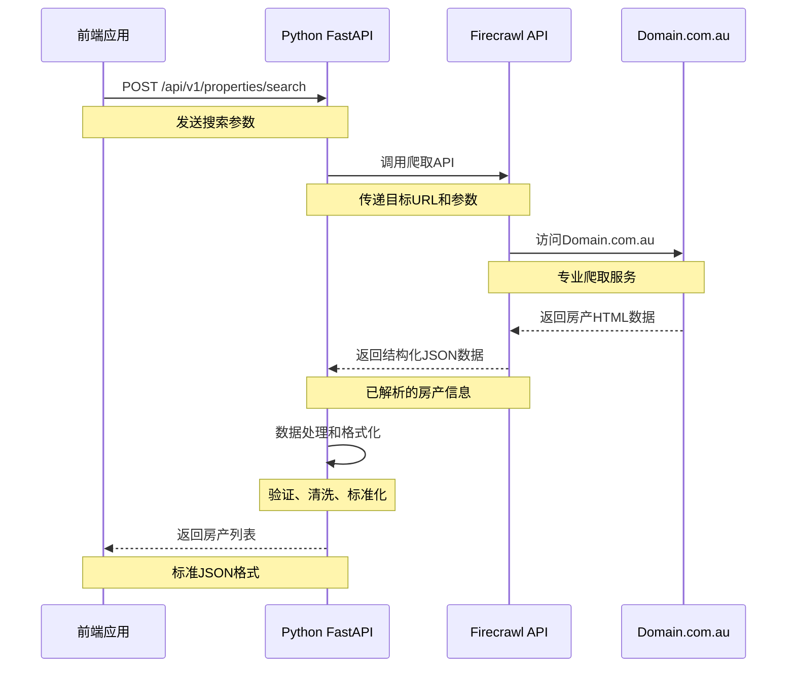

# 前后端协作指南 - 澳洲租房聚合系统

## 🤝 给前端开发者的完整指南

这份文档解答前端开发者关于后端API连接、数据抓取机制和实时性的所有疑问。

---

## 📋 目录
- [系统架构概览](#系统架构概览)
- [API工作机制详解](#api工作机制详解)
- [实时性说明](#实时性说明)
- [前端连接方法](#前端连接方法)
- [完整代码示例](#完整代码示例)
- [数据流程图解](#数据流程图解)
- [常见问题解答](#常见问题解答)
- [调试和排错](#调试和排错)

---

## 🏗️ 系统架构概览

### 当前技术栈
```
前端 (你的部分)     →     后端 (Python FastAPI)     →     外部数据源
   ├─ React/Vue/原生JS        ├─ FastAPI 框架               ├─ Domain.com.au
   ├─ HTTP请求               ├─ Firecrawl API              ├─ Real Estate.com.au
   └─ 数据展示               ├─ PostgreSQL                 └─ 其他房产网站
                           ├─ Redis缓存
                           └─ CSV导出
```

### 后端服务地址
- **开发环境**: `http://localhost:8000`
- **API文档**: `http://localhost:8000/docs` (Swagger UI)
- **健康检查**: `http://localhost:8000/health`

---

## ⚡ API工作机制详解

### 🔄 数据抓取流程 (重要！)

**我们的系统不是传统的爬虫，而是通过Firecrawl API进行数据抓取：**



### 🎯 实时性说明

**关键理解：这是"准实时"而非"实时"**

1. **数据获取方式**：
   - ✅ **每次搜索都是实时调用** Firecrawl API
   - ✅ **Firecrawl会实时访问** Domain.com.au
   - ✅ **数据是当时的最新数据**

2. **为什么可能"抓取不到"**：
   - 🔑 **API密钥问题**：Firecrawl API需要有效密钥
   - 🔑 **网络连接**：后端无法访问Firecrawl服务
   - 🔑 **区域限制**：搜索的区域名称不正确
   - 🔑 **服务状态**：Firecrawl或Domain.com.au临时不可用

3. **"实时"的含义**：
   ```
   用户搜索 → 立即调用API → 立即返回最新数据
   (不是预存数据，每次都是最新的)
   ```

---

## 🔌 前端连接方法

### 基础连接检查

**第1步：确认后端服务运行**
```bash
# 检查后端是否启动
curl http://localhost:8000/health

# 预期响应
{
  "status": "healthy",
  "timestamp": "2024-09-10T...",
  "version": "2.0.0-python"
}
```

**第2步：测试API连通性**
```bash
# 测试房产搜索接口
curl -X POST "http://localhost:8000/api/v1/properties/search" \
  -H "Content-Type: application/json" \
  -d '{"location": "Camperdown", "max_results": 5}'
```

### JavaScript前端连接示例

#### 方法1：原生Fetch API
```javascript
// 房产搜索函数
async function searchProperties(searchParams) {
  try {
    const response = await fetch('http://localhost:8000/api/v1/properties/search', {
      method: 'POST',
      headers: {
        'Content-Type': 'application/json',
        // 如果有CORS问题，确保后端已配置
      },
      body: JSON.stringify(searchParams)
    });

    if (!response.ok) {
      throw new Error(`HTTP error! status: ${response.status}`);
    }

    const data = await response.json();

    if (data.success) {
      console.log(`找到 ${data.properties.length} 个房产`);
      return data.properties;
    } else {
      console.error('搜索失败:', data.message);
      return [];
    }
  } catch (error) {
    console.error('网络错误:', error);
    return [];
  }
}

// 使用示例
const searchParams = {
  location: "Camperdown",
  min_price: 500,
  max_price: 1000,
  bedrooms: 2,
  property_type: "Apartment",
  max_results: 20
};

searchProperties(searchParams).then(properties => {
  // 在前端展示房产数据
  displayProperties(properties);
});
```

#### 方法2：Axios库
```javascript
import axios from 'axios';

// 配置基础URL
const API_BASE_URL = 'http://localhost:8000';
const api = axios.create({
  baseURL: API_BASE_URL,
  timeout: 30000, // 30秒超时
  headers: {
    'Content-Type': 'application/json'
  }
});

// 房产搜索
export const searchProperties = async (searchParams) => {
  try {
    const response = await api.post('/api/v1/properties/search', searchParams);
    return response.data;
  } catch (error) {
    console.error('API调用失败:', error);
    throw error;
  }
};

// 健康检查
export const checkHealth = async () => {
  try {
    const response = await api.get('/health');
    return response.data;
  } catch (error) {
    console.error('健康检查失败:', error);
    return { status: 'unhealthy' };
  }
};
```

#### 方法3：React Hook示例
```javascript
import { useState, useEffect } from 'react';

const usePropertySearch = () => {
  const [properties, setProperties] = useState([]);
  const [loading, setLoading] = useState(false);
  const [error, setError] = useState(null);

  const searchProperties = async (searchParams) => {
    setLoading(true);
    setError(null);

    try {
      const response = await fetch('http://localhost:8000/api/v1/properties/search', {
        method: 'POST',
        headers: { 'Content-Type': 'application/json' },
        body: JSON.stringify(searchParams)
      });

      const data = await response.json();

      if (data.success) {
        setProperties(data.properties);
      } else {
        setError(data.message);
      }
    } catch (err) {
      setError('网络连接失败');
    } finally {
      setLoading(false);
    }
  };

  return { properties, loading, error, searchProperties };
};

// 在组件中使用
function PropertySearch() {
  const { properties, loading, error, searchProperties } = usePropertySearch();

  const handleSearch = () => {
    searchProperties({
      location: "Camperdown",
      bedrooms: 2,
      max_results: 10
    });
  };

  return (
    <div>
      <button onClick={handleSearch} disabled={loading}>
        {loading ? '搜索中...' : '搜索房产'}
      </button>

      {error && <div className="error">错误: {error}</div>}

      <div className="properties">
        {properties.map(property => (
          <div key={property.id} className="property-card">
            <h3>{property.title}</h3>
            <p>价格: {property.price}</p>
            <p>位置: {property.location}</p>
            <p>房间: {property.bedrooms}室{property.bathrooms}浴</p>
          </div>
        ))}
      </div>
    </div>
  );
}
```

---

## 📊 完整代码示例

### 完整的前端应用示例
```html
<!DOCTYPE html>
<html>
<head>
    <title>澳洲租房搜索</title>
    <style>
        .container { max-width: 1200px; margin: 0 auto; padding: 20px; }
        .search-form { background: #f5f5f5; padding: 20px; border-radius: 8px; margin-bottom: 20px; }
        .property-card { border: 1px solid #ddd; padding: 15px; margin: 10px 0; border-radius: 5px; }
        .loading { color: #666; text-align: center; padding: 20px; }
        .error { color: red; background: #ffe6e6; padding: 10px; border-radius: 5px; }
        .success { color: green; background: #e6ffe6; padding: 10px; border-radius: 5px; }
    </style>
</head>
<body>
    <div class="container">
        <h1>🏠 澳洲租房搜索系统</h1>

        <!-- 搜索表单 -->
        <div class="search-form">
            <h2>搜索条件</h2>
            <form id="searchForm">
                <label>搜索区域: <input type="text" id="location" value="Camperdown" required></label><br><br>
                <label>最低价格: <input type="number" id="minPrice" value="500"></label>
                <label>最高价格: <input type="number" id="maxPrice" value="1000"></label><br><br>
                <label>卧室数量: <input type="number" id="bedrooms" value="2"></label>
                <label>浴室数量: <input type="number" id="bathrooms" value="1"></label><br><br>
                <label>房产类型:
                    <select id="propertyType">
                        <option value="">所有类型</option>
                        <option value="Apartment">公寓</option>
                        <option value="House">独立屋</option>
                        <option value="Townhouse">联排别墅</option>
                    </select>
                </label><br><br>
                <button type="submit">🔍 搜索房产</button>
            </form>
        </div>

        <!-- 状态显示 -->
        <div id="status"></div>

        <!-- 结果显示 -->
        <div id="results"></div>
    </div>

    <script>
        const API_BASE = 'http://localhost:8000';

        // 检查后端连接
        async function checkConnection() {
            try {
                const response = await fetch(`${API_BASE}/health`);
                const data = await response.json();
                showStatus(`✅ 后端连接正常 (版本: ${data.version})`, 'success');
                return true;
            } catch (error) {
                showStatus(`❌ 后端连接失败: ${error.message}`, 'error');
                return false;
            }
        }

        // 搜索房产
        async function searchProperties(searchParams) {
            showStatus('🔄 正在搜索房产...', 'loading');

            try {
                const response = await fetch(`${API_BASE}/api/v1/properties/search`, {
                    method: 'POST',
                    headers: { 'Content-Type': 'application/json' },
                    body: JSON.stringify(searchParams)
                });

                const data = await response.json();

                if (data.success) {
                    showStatus(`✅ 搜索成功，找到 ${data.properties.length} 个房产`, 'success');
                    displayProperties(data.properties, data.metadata);
                } else {
                    showStatus(`❌ 搜索失败: ${data.message}`, 'error');
                }
            } catch (error) {
                showStatus(`❌ 网络错误: ${error.message}`, 'error');
            }
        }

        // 显示状态信息
        function showStatus(message, type) {
            const statusDiv = document.getElementById('status');
            statusDiv.innerHTML = `<div class="${type}">${message}</div>`;
        }

        // 显示房产列表
        function displayProperties(properties, metadata) {
            const resultsDiv = document.getElementById('results');

            if (properties.length === 0) {
                resultsDiv.innerHTML = '<p>未找到符合条件的房产</p>';
                return;
            }

            let html = `<h2>搜索结果 (${properties.length} 个房产，搜索耗时: ${metadata.search_time_ms.toFixed(1)}ms)</h2>`;

            properties.forEach(property => {
                html += `
                    <div class="property-card">
                        <h3>${property.title}</h3>
                        <p><strong>价格:</strong> ${property.price}</p>
                        <p><strong>位置:</strong> ${property.location}</p>
                        <p><strong>房间:</strong> ${property.bedrooms || 'N/A'}室 ${property.bathrooms || 'N/A'}浴 ${property.parking || 0}车位</p>
                        <p><strong>类型:</strong> ${property.property_type}</p>
                        <p><strong>描述:</strong> ${property.description}</p>
                        <p><strong>特色:</strong> ${property.features.join(', ')}</p>
                        <p><strong>中介:</strong> ${property.agent.name} - ${property.agent.phone}</p>
                        <p><strong>数据来源:</strong> ${property.source}</p>
                        <p><strong>更新时间:</strong> ${new Date(property.scraped_at).toLocaleString('zh-CN')}</p>
                        <a href="${property.url}" target="_blank">查看原网页</a>
                    </div>
                `;
            });

            resultsDiv.innerHTML = html;
        }

        // 表单提交处理
        document.getElementById('searchForm').addEventListener('submit', async (e) => {
            e.preventDefault();

            const searchParams = {
                location: document.getElementById('location').value,
                min_price: parseInt(document.getElementById('minPrice').value) || undefined,
                max_price: parseInt(document.getElementById('maxPrice').value) || undefined,
                bedrooms: parseInt(document.getElementById('bedrooms').value) || undefined,
                bathrooms: parseInt(document.getElementById('bathrooms').value) || undefined,
                property_type: document.getElementById('propertyType').value || undefined,
                max_results: 20
            };

            await searchProperties(searchParams);
        });

        // 页面加载时检查连接
        window.addEventListener('load', checkConnection);
    </script>
</body>
</html>
```

---

## 🔍 数据流程图解

### 详细数据流程
```
1. 前端发起搜索请求
   ↓
2. 后端接收请求参数
   ├─ 验证参数格式 (Pydantic)
   ├─ 检查必填字段
   └─ 参数合理性验证
   ↓
3. 调用Firecrawl API
   ├─ 构建Domain.com.au搜索URL
   ├─ 设置爬取参数
   └─ 发送HTTP请求到Firecrawl
   ↓
4. Firecrawl执行爬取
   ├─ 访问Domain.com.au
   ├─ 解析HTML内容
   ├─ 提取房产信息
   └─ 返回结构化数据
   ↓
5. 后端处理数据
   ├─ 数据清洗和验证
   ├─ 格式标准化
   ├─ 生成UUID
   └─ 添加时间戳
   ↓
6. 后台任务 (可选)
   ├─ 保存到数据库
   ├─ 生成CSV文件
   └─ 更新缓存
   ↓
7. 返回给前端
   ├─ JSON格式响应
   ├─ 包含元数据
   └─ 错误处理
```

### API响应结构详解
```javascript
{
  "success": true,                    // 请求是否成功
  "properties": [                     // 房产数组
    {
      "id": "uuid-string",           // 唯一标识
      "title": "房产标题",
      "price": "$650/week",          // 价格字符串
      "location": "Camperdown",      // 地区
      "bedrooms": 2,                 // 卧室数
      "bathrooms": 1,                // 浴室数
      "parking": 1,                  // 停车位
      "property_type": "Apartment",  // 房产类型
      "description": "详细描述...",
      "features": ["空调", "阳台"],   // 特色列表
      "images": ["url1", "url2"],    // 图片URLs
      "agent": {                     // 中介信息
        "name": "中介姓名",
        "phone": "电话号码",
        "email": "邮箱地址"
      },
      "coordinates": {               // 坐标 (如有)
        "lat": -33.8688,
        "lng": 151.2093
      },
      "url": "原网页链接",
      "source": "数据来源",
      "scraped_at": "抓取时间ISO格式"
    }
  ],
  "metadata": {                      // 搜索元数据
    "total_found": 15,               // 总找到数量
    "search_time_ms": 2847.5,        // 搜索耗时
    "firecrawl_usage": {             // API使用信息
      "credits_used": 1,
      "credits_remaining": 999
    },
    "search_params": { ... },        // 原始搜索参数
    "timestamp": "响应时间"
  },
  "message": "成功找到 15 个房产"      // 用户友好消息
}
```

---

## ❓ 常见问题解答

### Q1: "找不到后端数据" 怎么办？

**A1: 逐步排查清单**
```bash
# 1. 检查后端是否启动
curl http://localhost:8000/health
# 期望: {"status": "healthy", ...}

# 2. 检查端口是否正确
netstat -an | grep 8000
# 或者
netstat -an | grep 3000

# 3. 测试简单API调用
curl -X POST "http://localhost:8000/api/v1/properties/search" \
  -H "Content-Type: application/json" \
  -d '{"location": "Sydney"}'

# 4. 检查CORS设置
# 在浏览器开发者工具中查看是否有CORS错误
```

### Q2: 为什么搜索结果为空？

**A2: 可能的原因和解决方案**

1. **Firecrawl API密钥问题**
   ```bash
   # 检查环境变量
   echo $FIRECRAWL_API_KEY
   # 或检查.env文件
   cat .env | grep FIRECRAWL
   ```

2. **搜索区域名称不正确**
   ```javascript
   // 使用标准的澳洲区域名称
   const validLocations = [
     "Sydney", "Melbourne", "Brisbane", "Perth", "Adelaide",
     "Camperdown", "Newtown", "Bondi", "Carlton", "Fitzroy"
   ];
   ```

3. **搜索条件过于严格**
   ```javascript
   // 尝试宽松的搜索条件
   const searchParams = {
     location: "Sydney",        // 只设置必填项
     max_results: 50           // 增加结果数量
   };
   ```

### Q3: 如何处理网络超时？

**A3: 增加超时处理**
```javascript
const searchWithTimeout = async (searchParams, timeout = 30000) => {
  const controller = new AbortController();
  const timeoutId = setTimeout(() => controller.abort(), timeout);

  try {
    const response = await fetch('/api/v1/properties/search', {
      method: 'POST',
      headers: { 'Content-Type': 'application/json' },
      body: JSON.stringify(searchParams),
      signal: controller.signal
    });

    clearTimeout(timeoutId);
    return await response.json();
  } catch (error) {
    if (error.name === 'AbortError') {
      throw new Error('请求超时，请稍后重试');
    }
    throw error;
  }
};
```

### Q4: 如何实现实时搜索建议？

**A4: 防抖动搜索实现**
```javascript
function useDebounce(value, delay) {
  const [debouncedValue, setDebouncedValue] = useState(value);

  useEffect(() => {
    const handler = setTimeout(() => {
      setDebouncedValue(value);
    }, delay);

    return () => {
      clearTimeout(handler);
    };
  }, [value, delay]);

  return debouncedValue;
}

// 使用示例
function SearchInput() {
  const [searchTerm, setSearchTerm] = useState('');
  const debouncedSearchTerm = useDebounce(searchTerm, 500);

  useEffect(() => {
    if (debouncedSearchTerm) {
      // 执行搜索
      searchProperties({ location: debouncedSearchTerm });
    }
  }, [debouncedSearchTerm]);

  return (
    <input
      type="text"
      value={searchTerm}
      onChange={(e) => setSearchTerm(e.target.value)}
      placeholder="输入搜索区域..."
    />
  );
}
```

---

## 🔧 调试和排错

### 后端日志查看
```bash
# 如果使用Docker
docker-compose logs -f app

# 如果直接运行Python
tail -f logs/app.log
```

### 前端调试技巧
```javascript
// 1. 在浏览器控制台启用详细日志
localStorage.setItem('debug', 'true');

// 2. 添加请求/响应日志
const loggedFetch = async (url, options) => {
  console.log('🚀 发送请求:', url, options);

  try {
    const response = await fetch(url, options);
    const data = await response.json();
    console.log('✅ 收到响应:', data);
    return data;
  } catch (error) {
    console.error('❌ 请求失败:', error);
    throw error;
  }
};

// 3. 网络面板检查
// 打开开发者工具 > Network 标签
// 查看API请求的状态码、响应时间、响应内容
```

### API测试工具推荐
```bash
# 1. 使用curl测试
curl -X POST "http://localhost:8000/api/v1/properties/search" \
  -H "Content-Type: application/json" \
  -d '{"location": "Sydney"}' \
  -v  # 显示详细信息

# 2. 使用Postman
# 导入API集合: 访问 http://localhost:8000/docs
# 点击 "Download OpenAPI JSON"

# 3. 使用HTTPie (推荐)
pip install httpie
http POST localhost:8000/api/v1/properties/search location=Sydney
```

---

## 📞 获取技术支持

### 快速检查清单
- [ ] 后端服务是否启动？
- [ ] API地址是否正确？
- [ ] 网络连接是否正常？
- [ ] CORS设置是否正确？
- [ ] Firecrawl API密钥是否有效？
- [ ] 搜索参数是否合理？

### 联系方式
- **API文档**: http://localhost:8000/docs
- **健康检查**: http://localhost:8000/health
- **项目仓库**: https://github.com/ZeshiKing/sydney-property-ai-Arthur

---

## 🎯 总结

1. **系统工作原理**: 前端 → 后端API → Firecrawl → Domain.com.au → 返回数据
2. **实时性说明**: 每次搜索都实时调用，不是预存数据
3. **连接方法**: 使用HTTP POST请求调用 `/api/v1/properties/search`
4. **数据格式**: 标准JSON格式，包含完整的房产信息
5. **错误处理**: 完善的错误提示和状态管理

**现在你可以放心连接后端API了！** 🚀

---

*如果还有任何疑问，请随时查看API文档或与后端开发者联系。*